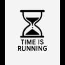
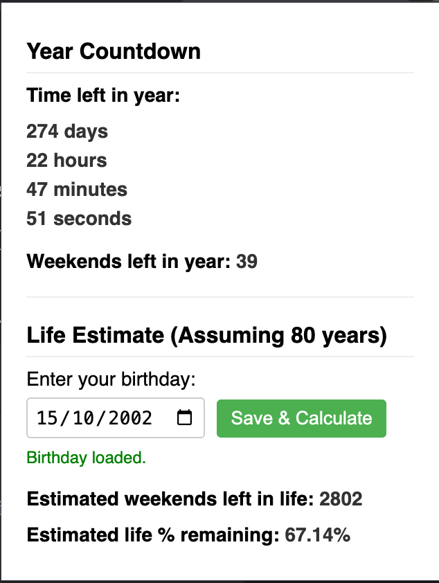

# Time is Running - Chrome/Brave Extension

 A simple browser extension for Google Chrome and Brave that helps you visualize the passage of time within the current year and your estimated lifespan.

---

## Screenshots



---

## Features

* **Year Countdown:** Displays the exact time remaining (Days, Hours, Minutes, Seconds) in the current year. Updates every second.
* **Weekends Left (Year):** Shows the estimated number of full weekends (Saturdays/Sundays counted as pairs) left in the current year.
* **Birthday Input:** Allows you to securely save your birthday. This is stored locally in your browser's storage and is not transmitted anywhere.
* **Life Estimation (Based on 80 Years):**
    * Calculates and displays the estimated number of *weekends* remaining in your life.
    * Calculates and displays the estimated *percentage* of your life remaining.

---

## Installation

Since this extension is not (yet) on the official web stores, you need to load it manually using Developer Mode.

**Steps:**

1.  **Download or Clone:**
    * Download this repository's code as a ZIP file and unzip it somewhere on your computer.
    * *OR* Clone the repository using Git:
        ```bash
        # Replace with your actual repository URL
        git clone [https://github.com/prat31/time-is-running-chrome-extension.git](https://www.google.com/search?q=https://github.com/prat31/time-is-running-chrome-extension.git)
        ```

2.  **Open Browser Extensions Page:**
    * **In Chrome:** Type `chrome://extensions` in your address bar and press Enter.
    * **In Brave:** Type `brave://extensions` in your address bar and press Enter.

3.  **Enable Developer Mode:**
    * Look for a toggle switch labeled "**Developer mode**" (usually in the top-right corner) and turn it **ON**.

4.  **Load Unpacked Extension:**
    * Click the "**Load unpacked**" button that appears.

5.  **Select the Folder:**
    * A file browser window will open. Navigate to and select the **folder** where you unzipped or cloned the code (the folder containing the `manifest.json` file). Do *not* select the individual files. Click "Select Folder" or "Open".

6.  **Done!**
    * The "Time is Running" extension should now appear in your list of extensions.
    * Its hourglass icon should appear in your browser toolbar. You might need to click the puzzle piece icon (Extensions) and then the pin icon next to "Time is Running" to keep it visible on the toolbar.

---

## Usage

1.  Click the hourglass icon in your browser toolbar to open the popup.
2.  The current year's countdowns are displayed immediately.
3.  To enable the life estimation features:
    * Enter your date of birth using the date picker under "Life Estimate".
    * Click the "Save & Calculate" button.
4.  Your birthday is saved locally for future use, so you only need to enter it once. The life estimates will appear automatically on subsequent opens.

---

## Project Structure

├── images/               # Extension icons
│   ├── icon16.png
│   ├── icon48.png
│   └── icon128.png
├── manifest.json       # Core extension configuration file
├── popup.html          # The structure of the popup window (HTML)
├── popup.js            # The logic and calculations (JavaScript)
├── style.css           # Styling rules for the popup (CSS)
└── README.md           # This documentation file
└── LICENSE             # (Optional but recommended) License file (e.g., MIT)

---

## Development

If you want to modify the code:

1.  Make your changes to the HTML, CSS, or JavaScript files.
2.  Go back to your browser's extensions page (`chrome://extensions` or `brave://extensions`).
3.  Find the "Time is Running" extension card.
4.  Click the **reload icon** (a circular arrow) on the card.
5.  Re-open the extension popup to see your changes reflected.

---

## License

This project is licensed under the MIT License. See the [LICENSE](LICENSE) file for details.
